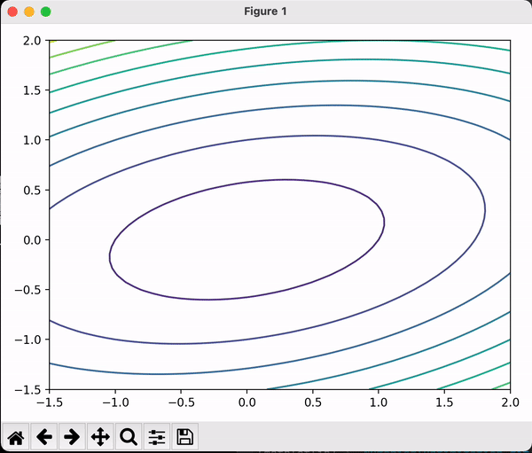
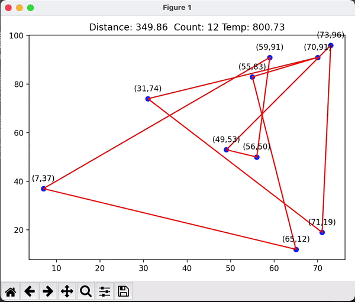
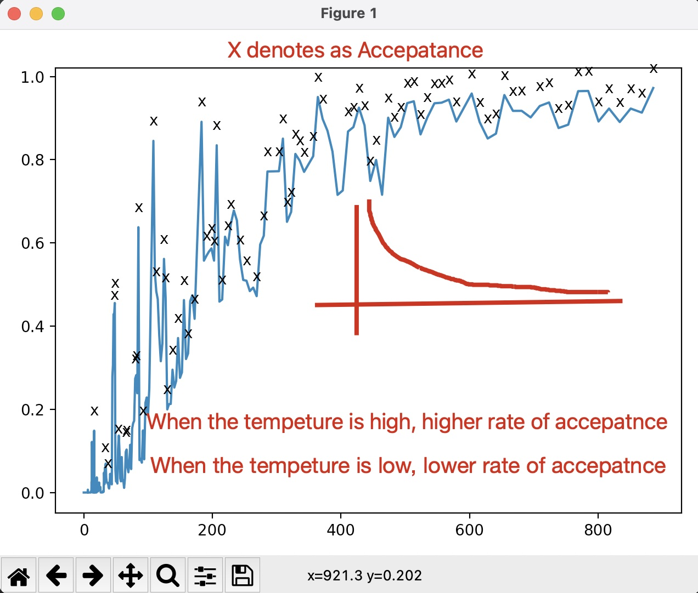
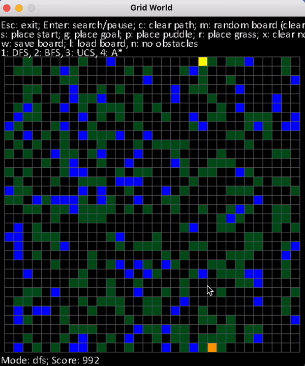

# Artificial Intelligence Algorithms

Code for Ai algorithm 

# Re-design the Repo to the link: https://github.com/3milesWind/Seach_and_Optimization

# Table of Contentsdesign

* [What is this?](#What-is-this)
* [Documentation](#Documentation)
* [matplotlib](#matplotlib)
  * [Animation](###Animation)
  * [Text the points](###Text-the-points )
* [Numerical Optimization](#Numerical-Optimization)
  * [Gradient Descent](###Gradient-Descent)
  * [Newton Method](###Newton-Method)
* [Stochastic Search](#Stochastic-Search)
  * [Simulated Annealing](###Simulated-Annealing)
* [Classic Search](#Classic-Search)
  * 

# What is this?

> This is a Python code collection of Artificial Intelligence Algorithms
>
> During Master degree, Try to collect all the Intelligence algrithms I learn
>
> CheckList:
>
> > - [ ]  Stochastic Search
> > - [x]   Numerical Optimization
> > - [x]  Classical Search

# Documentation
1. Clone this repo.

> git clone https://github.com/3milesWind/AiRobotics.git

2. Install the required libraries.

using conda :

> conda env create -f environment.yml

3. Execute python script in each directory.

4. Add star to this repo if you like it :smiley:.

# matplotlib

> Matplotlib is a comprehensive library for creating static, animated, and interactive visualizations in Python

### Animation

Code: [SimpleAnimation1.py](matplotlib/SimpleAnimation1.py)

### Text the points 

###  [code](matplotlib/SimpleMakeTextEachPoint.py)

# Numerical Optimization

> *Numerical Optimization* presents a comprehensive and up-to-date description of the most effective methods in continuous optimization.

### Gradient Descent 

###  [Background](Docs/GradientDescent.md)

> Gradient descent is a first-order iterative optimization algorithm for finding a local minimum of a differentiable function. 

Example Function: 

* With a fixed learning rate    [Code](NumericalOptimization/gradientDescentWithFixedRate.py)

  

* With a Optimal learning rate [Code](NumericalOptimization/gradientDescentWithOptimalRate.py)

  

### Newton Method

Example Function: 

[Code](NumericalOptimization/NewtonMethod.py)

> Newton's method is a powerful technique—in general the [convergence](https://en.wikipedia.org/wiki/Rate_of_convergence) is quadratic: as the method converges on the root, the difference between the root 

* some difficulties: 
  * Can not be singular matrix
  * Derivattive can not be zeros

# Stochastic Search 

## Simulated-Annealing 

**The Travelling Salesman Problem ** [code](TravellingSalesman/Simulated_Annealing.py)   [Simple Presentation](TravellingSalesman/Presentation1.pptx) 

> Simulated annealing algorithm is a random algorithm, it has a certain probability to find the global optimal solution

# Classic-Search

### Depth-First Search (DFS) 

> The algorithm starts at the root node (selecting some arbitrary node as the root node in the case of a graph) and explores as far as possible along each branch before backtracking.         

### Breadth-first search (BFS)

> It starts at the tree root and explores all nodes at the present depth prior to moving on to the nodes at the next depth level. Extra memory, usually a queue is needed to keep track of the child nodes that were encountered but not yet explored.

### Dijkstra 

> For a given source node in the graph, the algorithm finds the shortest path between that node and every other with cost

### A*

> A* is an informed search algorithm, **or a best-first search**, meaning that it is formulated in terms of weighted graphs: starting from a specific starting node of a graph, it aims to find a path to the given goal node having the smallest cost

