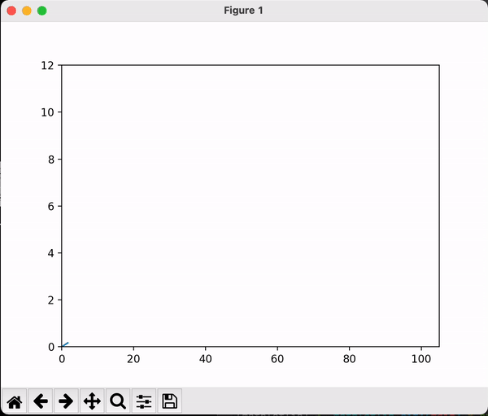

# Artificial Intelligence Algorithms

Code for Ai algorithm 

# Table of Contents

* [What is this?](#What-is-this)
* [Documentation](#Documentation)
* [matplotlib](#matplotlib)

# What is this?

> This is a Python code collection of Artificial Intelligence Algorithms
>
> During Master degree, Try to collect all the Intelligence algrithms I learn
>
> CheckList:
>
> > - [ ]  Stochastic Search
> > - [ ]  Classical Search

# Documentation
1. Clone this repo.

> git clone https://github.com/3milesWind/AiRobotics.git

2. Install the required libraries.

using conda :

> conda env create -f environment.yml

3. Execute python script in each directory.

4. Add star to this repo if you like it :smiley:.

# matplotlib

> Matplotlib is a comprehensive library for creating static, animated, and interactive visualizations in Python

### Animation

Code: [SimpleAnimation1.py](matplotlib/SimpleAnimation1.py)

