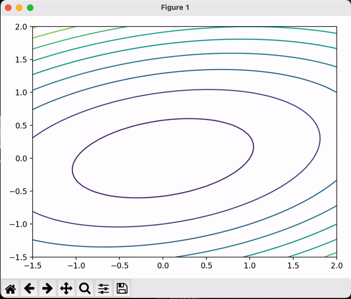

# Artificial Intelligence Algorithms

Code for Ai algorithm 

# Table of Contents

* [What is this?](#What-is-this)
* [Documentation](#Documentation)
* [matplotlib](#matplotlib)
* [Numerical Optimization](#Numerical-Optimization)

# What is this?

> This is a Python code collection of Artificial Intelligence Algorithms
>
> During Master degree, Try to collect all the Intelligence algrithms I learn
>
> CheckList:
>
> > - [ ]  Stochastic Search
> > - [ ]  Classical Search

# Documentation
1. Clone this repo.

> git clone https://github.com/3milesWind/AiRobotics.git

2. Install the required libraries.

using conda :

> conda env create -f environment.yml

3. Execute python script in each directory.

4. Add star to this repo if you like it :smiley:.

# matplotlib

> Matplotlib is a comprehensive library for creating static, animated, and interactive visualizations in Python

### Animation

Code: [SimpleAnimation1.py](matplotlib/SimpleAnimation1.py)

# Numerical Optimization

> *Numerical Optimization* presents a comprehensive and up-to-date description of the most effective methods in continuous optimization.

### Gradient Descent  [Background](Docs/GradientDescent.md)

> Gradient descent is a first-order iterative optimization algorithm for finding a local minimum of a differentiable function. 

Example Function: $x_1^2 + x_1 * x_2 + 3x_2^2 + 5$ 

* With a fixed learning rate    [Code](NumericalOptimization/gradientDescentWithFixedRate.py)

  

* With a Optimal learning rate [Code](NumericalOptimization/gradientDescentWithOptimalRate.py)

  

### Newton Method

Example Function: $x_1^2 + x_1 * x_2 + 3x_2^2 + 5$ 

> Newton's method is a powerful technique—in general the [convergence](https://en.wikipedia.org/wiki/Rate_of_convergence) is quadratic: as the method converges on the root, the difference between the root 

* Pro
* Con
